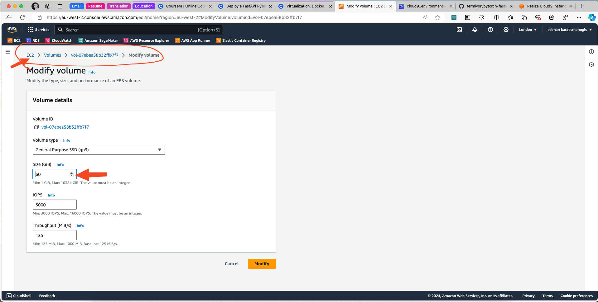
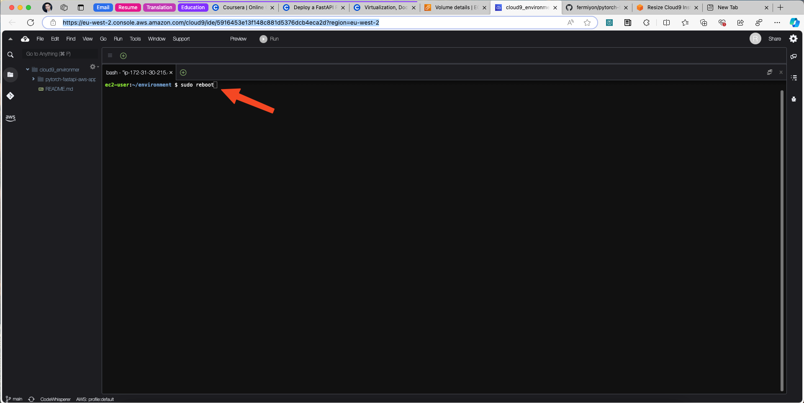
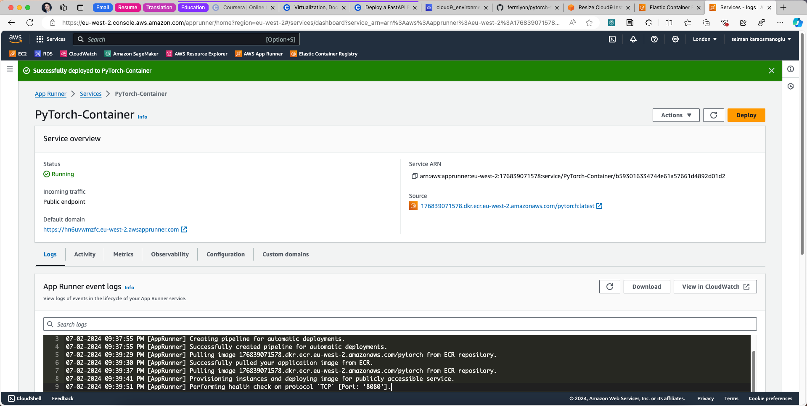

By Selman Karaosmanoglu 

## Date created
2 July 2024

# FastAPI PyTorch Deployment on AWS

## Overview

This project demonstrates how to deploy a PyTorch model using FastAPI on AWS App Runner. It provides a scalable and efficient way to serve machine learning models. The project includes detailed instructions for building a Docker image on AWS Cloud9 and deploying it to AWS App Runner via AWS Elastic Container Registry (ECR). 

The PyTorch project was converted from the official PyTorch tutorial using Flask by Noah Gift.

Tasks:

1.  Run the fastapi app:  `python app.py`
2.  Upload an image to classify, say a cat using the swagger docs url:  /docs
3.  Deploy to AWS and the AWS App Runner service

## Notes on Running docker with PyTorch and FastAPI

```bash
docker build .
```

Note use: `docker images` to find (replace id with the image id):

```bash
docker run -p 127.0.0.1:8080:8080 54a55841624f
```

## Build, Push, Deploy Docker Image on AWS

## Getting Started

### Create AWS Cloud9 Environment

å


### Create Amazon Elastic Container Registry


### Build and Push Docker Image on AWS

#### Clone Git Repository to AWS Cloud9

```bash
git clone ..
```

#### Create virtual environemnt

```bash
python3 -m venv ~/.venv
```

#### Activate environment

```bash
source ~/.venv/bin/activate`
```


#### Increase AWS Cloud9 Volume Size

Go to the settings of the EC2 instance of Cloud9 and increase the volume size



#### Reboot Cloud9

```bash
sudo reboot
```



- Check volume size and build docker image

```bash
df --human-readable
```

```bash
docker build -t pytorch .
```


 
#### Run an instance of the Docker Image and preview it

```bash
docker images
```

```bash
docker run -p 127.0.0.1:8080:8080 <docker image id>
```

Click Preview button of AWS Cloud9 and go to /docs page of the FastAPI app in preview pane as shown in the screenshot below


#### View push commands in AWS Elastic Container Registry


#### Apply Docker push commands via AWS Cloud9 instance to AWS ECR

Login

```bash
aws ecr get-login-password --region eu-west-2 | docker login --username AWS --password-stdin 176839071578.dkr.ecr.eu-west-2.amazonaws.com
```

Docker Tag

```bash
docker tag pytorch:latest 176839071578.dkr.ecr.eu-west-2.amazonaws.com/pytorch:latest
```

Docker Push

```bash
docker push 176839071578.dkr.ecr.eu-west-2.amazonaws.com/pytorch:latest
```


#### Check Amazon Elastic Container Registry


### Create AWS App Runner Service




### Verify Swagger Working

Go to /docs url


### References

* [Resize Cloud9 Instance Root Volume](https://ec2spotworkshops.com/ecs-spot-capacity-providers/workshopsetup/resize_ebs.html)

* Duke University - Virtualization, Docker, Kubernetes Data Engineering Program